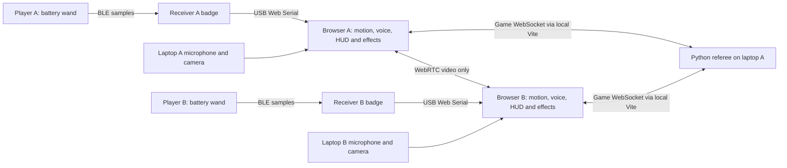

# Harry Potter Battle Simulator — Hackathon MVP

**Experience:** hold your hacker badge like a wand, say a spell, and perform its movement to duel a real opponent through a live-video portal.

**Target:** Hack the North 2026 — Best Badge Hack. **Revised:** September 19, 2026. **Repository baseline:** `6f712e6`. This is an implementation plan, not a claim that the proposed voice-and-motion multiplayer experience has been validated.

**Selected build:** two wireless handheld wands, two USB receiver badges, Windows Chrome companions, browser-owned voice/motion recognition, one Python referee, WebRTC video and Three.js effects. [Section 13](#13-technical-implementation-blueprint-and-joint-development-workflow) defines the implementation and agent/Sai QA handoffs. All four available badges have a role; none is a spare.

## 1. The product decision

The badge is the wand, not a gamepad. **Every spell requires both a spoken incantation and a deliberate badge movement.** The spoken name identifies the spell; the motion verifies that the player performed it. No spell selection, button arming, button release, or instant shield button.

Each player holds a battery-powered badge running our Lua wand app. It sends movement through the badge's existing Bluetooth-based radio to their second badge, which stays USB-connected beside the laptop as a receiver. The handheld wand has no cable during play. The laptop hears the incantation, combines it with the received movement, shows the opponent, and renders magic. One match server decides combat results.

This is a **badge app plus a computer companion**, not a browser game running inside the badge. Stock badge Lua does not expose a microphone, camera, or browser runtime; spoken-spell recognition runs on the computer. [Official Lua guide](badge-app-guide.md)

### What we ship

| Required | Scope |
| --- | --- |
| Physical wand input | Four badges: one wireless wand and one USB receiver per player; automatic motion capture with no gameplay buttons |
| Incantation recognition | A tiny spell vocabulary through each player's computer/headset microphone; required for all casts |
| Combat | Stupefy, Protego, then Expelliarmus; health, cooldowns, scheduled impacts, win/draw and rematch |
| Multiplayer | One two-player room at a time; shared authoritative state; opponent live video |
| Presentation | Three.js projectile, shield and disruption effects over a video portal; readable health/cooldown HUD |
| Badge experience | Motion-sensitive LEDs, a concise gesture guide, movement-capture feedback |
| Setup | Browser-led connection, short calibration, practice and Ready/Rematch controls |

**First playable milestone:** Stupefy versus Protego with real speech and real badge motion on two laptops. **Target completed MVP:** add Expelliarmus and polish those three spells. If only two spells pass the tests, present an explicitly scoped two-spell duel rather than weakening the input contract.

**Effect placement:** fixed anchors over the opponent's video. Camera-based tracking is outside the initial implementation; camera analysis is not a spell input.

Remove mana, extra spells, ultimate attacks, beam clashes, perfect-parry rules, loadouts, chaos/referee badge gameplay, progression, custom firmware, and badge-side match-result messaging from this hackathon plan. Radio carries movement only. Focus on one convincing loop: **say it, move the wand, see the magic, counter the opponent**.

## 2. Player journey: no gamepad controls

1. **Connect.** Launch the wand and receiver apps. Open the companion in desktop Chrome, select the USB receiver, and grant microphone/camera access. In the browser, select the wand address matching its screen and confirm it with a movement. Show separate receiver, wireless-wand, microphone, video and server status.
2. **Calibrate.** The browser asks for a still grip, then a few gentle examples of the jab, raised guard and sweep. Rehearse each incantation. Calibration and coaching happen on the laptop; no badge menu navigation is required during play.
3. **Join.** Create/join the two-player room and click Ready on the laptop. Both ready starts a shared countdown. Start listening before the countdown completes so the recognizer is actually available at round start.
4. **Duel.** Say “Stupefy!” while making a short jab. Say “Protego!” while raising the badge into a guard. Say “Expelliarmus!” while sweeping sideways. Nothing needs to be equipped first.
5. **Recover.** Let the badge settle briefly between movements. That natural reset separates casts; there is no press-to-arm action.
6. **Finish.** Both screens show the same result and a simple landed-spells/blocks recap. Click Rematch on the laptop.

**Badge buttons:** do not assign A/B, directions or Start any combat behavior. Preserve Home's normal exit and whatever stock launcher controls are needed to open the app. Ready, recalibration and rematch belong to browser setup, not physical spell casting. A development-only event simulator may exist, visibly labelled and disabled in the real duel; it is not an alternate player input mode.

Use a secure grip and small wrist/forearm movements. The wand uses the supplied two AA alkaline batteries; USB cables stay at the receivers. No throwing the badge, striking objects, or swinging it by the lanyard. Follow the official power/USB instructions and stop if a device becomes hot or behaves unexpectedly. [Badge manual](https://badge.hackthenorth.com/manual), [badge safety rules](https://badge.hackthenorth.com/rules)

## 3. Three spells and a small combat engine

All numbers below are starting proposals to tune on physical devices. The game effects are adaptations, not claims of exact fictional canon. [Official spell background](https://www.harrypotter.com/features/the-most-important-spells-harry-taught-da)

| Build priority | Spell and required input | Initial effect | Visual |
| --- | --- | --- | --- |
| **1 — attack** | **Stupefy:** say the name + short jab and settle | 20 damage; 2-second cooldown; initially 2-second projectile travel | Crimson bolt with a spark trail |
| **2 — defense** | **Protego:** say the name + raise badge into a brief held guard | Shield lasts 1.2 seconds, blocks one Stupefy, then breaks; 3-second cooldown | Cyan curved shield with an impact ripple |
| **3 — disruption** | **Expelliarmus:** say the name + lateral sweep and settle | 10 damage and 1-second offensive lockout if unshielded; shield breaks and prevents both effects; 6-second cooldown; initially 2.2-second travel | Red-gold ribbon and a broken-wand status rune |

### Shared rules

- One 60-second round; 100 health each. Zero health loses. At timeout, higher health wins; equal health is a draw. Use the same rules for practice matches and judging.
- No mana system. Cooldowns supply the resource constraint. The HUD shows which spells are available.
- Offense shares a short 600 ms global recovery as well as spell cooldowns. Protego is not blocked by offensive recovery or disarm, but still requires its own voice, movement and cooldown checks.
- All attacks target the opponent. The camera is for presence and effects, not physical hit detection. Leaning out of frame is not a dodge.
- An accepted attack creates a projectile with a future impact time. Damage is resolved at impact against the current shield/status, not immediately on recognition.
- Protego becomes active only when the server accepts the complete voice-and-motion cast. Do not secretly grant a button shield, pre-activate from an unfinished word, or backdate it after an impact.
- Initial 2–2.2-second flight times deliberately accommodate hearing the warning, speaking, gesturing, recognition and network delay. Measure this entire path and lengthen travel if necessary. A visibly defendable duel matters more than artificially fast projectiles.
- Failed recognition or server rejection causes no damage and starts no spell cooldown. Explain the reason briefly on the laptop.
- Disarm blocks new offensive casts only. Already launched projectiles remain. Resolve impacts due in the same server step as a batch; simultaneous knockouts are a draw.
- A receiver disconnect, stale wireless wand, sustained speech outage or lost player game connection aborts the round, clears pending inputs/projectiles and awards no winner. A clean idle recognizer turnover may recover within a bounded gap; a gap overlapping a pending cast or incoming attack aborts under Section 13.3's fairness rule. No casts are accepted during the gap. Recover and ready for a fresh round. Video-only loss is reported separately; stop and restart the live demo if it cannot be restored.

## 4. Recognizing spells without buttons

**Recognition contract: fresh incantation + compatible deliberate motion = one cast.** Neither input alone is sufficient. No LLM or trained gesture model is needed in the critical path.

### Motion: continuous sensing, bounded gestures

The documented accelerometer is cached at 50 Hz and returns three-axis acceleration, not 3D position. There is no documented gyro. Rotation changes gravity's contribution, so arbitrary wand-rune reconstruction is out of scope. [Sensor API](badge-app-guide.md)

**Implementation:** the wand broadcasts one compact, timestamped acceleration sample at a target 20 Hz; the receiver forwards it over USB. The browser owns the single canonical segmenter, calibrated movement classifier and voice fusion. The wand computes only a lightweight activity indicator. Calibration changes therefore stay on the laptop instead of requiring badge uploads. The radio rate is a starting target to measure, not a documented throughput guarantee.

Automatically segment movement in the browser using a still baseline, activity threshold, short capture window and settling hysteresis. A first candidate configuration is 200 ms of rest, a 150–900 ms movement, then 150 ms of settling; guard recognition can complete after a short stable raised pose. These are hypotheses, not device-proven thresholds. Require a fresh rest-to-motion transition for the next candidate.

Each sample carries an app-run identifier, sequence, device timestamp, acceleration in milligravity and sensor status, within the radio's 44-byte payload limit. The browser derives candidates with onset/end and jab/sweep/guard evidence, retaining a short bounded buffer. No radio retries of old samples and no fragmented sample messages: fresh input matters more than complete history. Section 13.2 defines loss handling and the wireless qualification gate.

Calibrate idle noise, grip orientation and safe amplitudes per player in the browser. Use `badge.sys.ms()` and browser receipt times to estimate stream timing; do not directly compare unsynchronized clocks. Reject buffered/stale data after a stall. Raw motion is broadcast to nearby badge receivers, not a private paired link; calibration stays browser-local and the referee receives cast requests, not raw samples.

The three motions should be deliberately broad. A jab needs an impulse and settling, not accurate forward distance. A sweep needs a lateral burst, not a reconstructed arc. A guard needs a new raising movement followed by a held orientation; holding the same pose cannot repeatedly recast it. If separation is weak, tune those patterns and cut the third spell before adding a machine-learning project.

### Speech: available throughout a live duel, narrowly interpreted

The laptop recognizer listens during explicit practice/countdown/play only, after permission and a browser interaction. It does not wait for a badge button. Restrict application acceptance to the shipped incantations and a small tested list of transcription aliases. Do not accept unrelated partial words or infer spells from shouting volume.

Use browser Web Speech (`SpeechRecognition` / `webkitSpeechRecognition`) in the qualified Windows Chrome build. Filter results ourselves: grammar settings do not enforce our vocabulary. This may send audio to the browser vendor's service and requires testing on the actual laptops/network; identify that processing to players. Do not promise offline operation or uninterrupted listening from `continuous`. No separate ASR service or native helper is part of the initial build. [SpeechRecognition documentation](https://developer.mozilla.org/en-US/docs/Web/API/SpeechRecognition)

Final recognition is the acceptance point; interim text may preview a rune but must not fire a spell. Expose listening/error state. If exact spell names, latency or listener reliability fail the first physical gate, stop and agree a revised speech plan before expanding the game. Do not silently substitute buttons or gesture-only gameplay.

### Pair evidence once, then expire it

The browser owns fusion. Keep one pending attempt per player, using a short rolling gesture buffer and recognizer capture IDs/timing. Accept voice before, during or just after the movement so the interaction feels natural; do not require the recognizer's result to arrive before motion begins.

1. Associate speech with its capture interval, not merely the time its text result arrives. Use recognizer speech-activity events with recognizer generation/result IDs. Allow only one unresolved utterance; a second utterance or uncertain result association invalidates the attempt. Repeated partial/final callbacks cannot become new utterances.
2. Initially allow at most a 350 ms gap between capture intervals, with their combined span no longer than 2 seconds. The final transcript must arrive no later than 1 second after the voice capture ends, in the same recognizer generation. A later gesture cannot extend that deadline. Tune these bounds from timestamps and reject ambiguous multiple-motion matches.
3. The recognized spell chooses which movement evidence must pass. “Stupefy” with guard-only evidence is rejected; a spoken name does not merely select a spell for a later unrelated movement.
4. When both inputs pass, consume both IDs and send exactly one session/round-bound cast request. Clear evidence on rejection, timeout, recognizer restart, round change, disconnect or page suspension. Require fresh input on return.
5. The server validates spell, player, round, cooldown and duplicates before accepting. Local motion lights can respond immediately, but damage and the full launched spell wait for acceptance.

| What happens | Result |
| --- | --- |
| Correct incantation and matching fresh gesture | One cast request |
| Movement without an incantation | No cast |
| Speech without a deliberate movement | No cast |
| Wrong motion, ambiguous speech or expired evidence | No cast; short coaching cue |
| Repeated transcript or serial packet | No second cast |
| Camera analysis absent | Casting works; effects use fixed anchors |
| Microphone/recognizer unavailable | Do not ready; abort an active round and recover |

**Venue noise is a first-hour risk.** Qualify the planned built-in microphones with placement/separation first; close-talk/headset microphones are a fallback if that setup fails. Default opponent media to video-only for the co-located demo and avoid spoken spell names in game sound effects. Neither echo cancellation nor this fusion rule proves speaker identity: explicitly test an opponent saying a spell while the local player moves. If nearby voices still trigger casts, change the physical setup before claiming reliability.

## 5. Wireless badge integration and computer access

Use the accelerometer, Bluetooth-based Lua radio, 320×240 display, six RGB LEDs, monotonic timestamps and tagged serial logs. Foreground Lua has a nominal 20 ms tick and a default 48 KiB allocation quota, not reserved physical RAM. **Enable radio before creating any widgets**, keep both apps small, reuse labels and throttle display updates. The repo's hardware test observed roughly 47 KB consumed by BLE startup; the ordering fix is necessary, not proof that our new apps fit. `wake_lock=1` prevents ordinary sleep while open, not Home exit. [Developer guide](badge-app-guide.md), [hardware measurements](docs/hardware-verification.md)

**Wireless method:** `badge.radio.send()` on the handheld wand → `badge.radio.on_recv()` on the USB receiver. This is the stock badge's restricted broadcast channel, not Bluetooth pairing with Windows. Lua exposes no arbitrary BLE/GATT service API, so a direct Web Bluetooth connection is not our implementation. The receiver uses the already-established gateway pattern in this repo. Two-way badge radio does not imply a laptop-to-wand command channel. [Official radio API](https://badge.hackthenorth.com/ide/README.md)

### Installation versus gameplay

- Install the wand app on two badges and the receiver app on the other two using the official IDE. Temporarily connect each for installation; disconnect handheld wands for battery-powered play. This uploads applications, not replacement firmware. [Official IDE](https://badge.hackthenorth.com/ide/)
- Disconnect the IDE's serial session. Each game browser opens its USB receiver through Web Serial. Only one application may own that port at a time; a person selects the device in the permission picker. [Web Serial](https://developer.chrome.com/docs/capabilities/serial)
- The public IDE uses 115200 baud and a console file-transfer protocol. A CLI uploader is possible, but building one is unnecessary for this MVP. The IDE does **not** need to stay open or proxy gameplay. [Public serial/upload implementation](https://badge.hackthenorth.com/ide/app.js?v=single-file-app-20260916)
- The receiver filters our radio prefix and writes source address, signal strength and sample/status lines with `badge.sys.log()`. Each browser accepts only its explicitly selected wand; both receivers may hear both wands. No automatic binding to the first packet received.
- Read-only local device enumeration and serial diagnostics can help an agent investigate a plugged-in badge. A person still connects/powers it, selects the device, launches the app and performs test gestures. Physical operation is not established by source inspection.

**Important boundary:** stock Lua has no documented serial receive callback. The receiver cannot relay laptop health/cooldowns or recognized words back to the wand in this design. No custom firmware, console-command bridge or flash-file mailbox. The laptop owns confirmed spell identity and match feedback; the wand owns immediate movement feedback. A successful radio send means queued, not delivered.

### What appears on the badge

| Local state | Screen | LEDs |
| --- | --- | --- |
| Idle | Three small spell/movement cues; “Say the spell and move” | Subtle neutral glow |
| Movement begins | Motion activity indicator | Brighten with a bounded activity level |
| Movement settles | “Motion settled” | Short neutral pulse |
| Too noisy/continuous | “Settle, then try again” | Soft amber cue |

The display is an always-available wand guide, not an equipped-spell menu. Local lights represent sensed activity, **not** a recognized spell or server-confirmed cast. Stage all six LEDs then call `show()` at a measured bounded cadence, initially no more than about 20 Hz. No false hit/health/victory claims on the badge. Show those on the laptop.

The receiver shows radio/forwarding status and drop counters, with a small receive pulse. The browser is the authority on whether fresh wand samples are actually arriving. All four apps must remain in the foreground; no combat or counter-reset buttons are needed.

## 6. Visual experience and assets, in build order

Keep the opponent large inside an enchanted mirror, with a small self-preview. Opponent health sits above the portal, own health below, and three cooldown indicators remain readable. During training, show “heard spell” and “detected movement”; hide diagnostics during the duel.

| Priority | Asset | Minimal approach |
| --- | --- | --- |
| 1 | Three spell glyphs, gesture cues, health/cooldown/result UI | Original line art reused on badge and browser; DOM/CSS HUD |
| 2 | Stupefy | Emissive bolt, short trail, pooled impact sparks |
| 3 | Protego | Transparent curved surface, glowing rim, impact ripple |
| 4 | Expelliarmus | Reuse projectile plumbing; twisting gold/red ribbon and brief status rune |
| 5 | Portal and sound | Procedural frame; restrained glow; original/licensed incoming, cast, block, hit and result sounds |

Use one transparent Three.js canvas over a normal opponent video element, with fixed spell origins. On the attacker screen, the bolt travels toward the opponent; on the defender screen, it approaches the camera and strikes the foreground shield. Both animations refer to the same server projectile and impact time. No video-textured mesh, hand tracking or camera hit detection in the initial build.

The showcase is a spoken Protego plus raised badge producing a shield that visibly catches a real opponent's Stupefy. Build that moment before decorative environments. Cap particles and pixel ratio, preload audio, and preserve at least 30 fps on both demo laptops; aim for 60 only after input is stable.

## 7. High-level architecture

The radio arrows show logical ownership: broadcasts are shared, so each receiver can physically hear both wands. Browser source filtering separates the players. The laptop's Bluetooth adapter is not used.

| Layer | Decision |
| --- | --- |
| Badges | Two stock-Lua apps: wireless wand sampler and USB radio receiver; no badge-side combat authority |
| Frontend | Existing React + TypeScript + Vite; Windows Chrome; Web Serial; Web Speech; local fusion; plain Three.js |
| Referee | Existing Python + FastAPI + Pydantic patterns; one two-player room; deterministic rules |
| Game transport | Session-bound WebSocket inputs/events/snapshots, around 20 Hz server updates |
| Media | Browser camera capture and WebRTC opponent video; audio chat omitted from the demo |
| Storage | In-memory match state and browser-local calibration; no accounts or database |

The server assigns player slots and opaque session tokens; it must not trust the badge's old self-declared P1/P2 labels or client-proposed damage. Input IDs are bound to connection/session and round. Local recognition is still a prototype trust boundary, not an anti-cheat system.

Use server time for impact/cooldown deadlines. Clients estimate clock offset for animation but cannot backdate cast requests. Bounded per-client outbound queues prevent one slow browser stalling combat. Reconnect starts a fresh round; no persistence/resumption system is required.

**Demo network:** both laptops on a controlled hotspot/LAN, each serving its frontend on localhost. The two Vite processes proxy game traffic to one session-protected Python referee on laptop A; WebRTC carries video separately. Section 13.4 specifies launch and security boundaries. Public hosting and a TURN relay are outside the initial implementation.

Camera/microphone and Web Serial need appropriate secure contexts. A frontend served over another machine's plain HTTP address is not equivalent to localhost. WebRTC still needs signalling; STUN is not a guaranteed relay. [Camera requirements](https://developer.mozilla.org/en-US/docs/Web/API/MediaDevices/getUserMedia), [WebRTC connectivity](https://developer.mozilla.org/en-US/docs/Web/API/WebRTC_API/Protocols)

No recording by default. Show when the microphone is listening, disclose external speech processing, and stop media tracks/recognition on leave. Limit diagnostics to short opt-in captures; do not retain raw voice/video for match history.

## 8. Refactor the current project around this interaction

The existing Phantom Arena uses local radio badges, a gateway, a Python referee and a passive browser viewer. Reuse useful infrastructure, not its control model.

| Existing source | Revision |
| --- | --- |
| [badges/phantom_player.lua](badges/phantom_player.lua) | Replace button casts, local spell selection, mana/cooldowns and repeated cast packets with compact raw-motion broadcasts; retain radio-first startup and bounded LED updates |
| [badges/phantom_gateway.lua](badges/phantom_gateway.lua) | Reuse radio-to-serial forwarding and drop diagnostics; accept the new sample protocol, preserve source identity and keep UI minimal |
| [game.py](apps/host/phantom_host/game.py) and [contracts.py](apps/host/phantom_host/contracts.py) | Retain deterministic/testable patterns; implement the three-spell rules, scheduled impacts, per-player cooldowns and round-bound inputs |
| [main.py](apps/host/phantom_host/main.py) and [broadcaster.py](apps/host/phantom_host/broadcaster.py) | Add real player input/session handling and bounded state delivery; current sockets only serve viewers |
| [App.tsx](apps/web/src/App.tsx) and [ArenaStage.tsx](apps/web/src/components/ArenaStage.tsx) | Add receiver connection, explicit wand binding, motion classification, mandatory speech fusion, setup/practice and the Three.js stage |
| [vision.py](apps/host/phantom_host/vision.py) | Remove host-camera/base64-JPEG snapshots from the new mode; browsers own camera capture and WebRTC |
| [badge_monitor.py](tools/badge_monitor.py) | Reuse for serial bring-up/raw inspection; its existing gateway-protocol diagnostics need adaptation for the new movement protocol |
| [apps/host/tests](apps/host/tests/) and [fake_gateway.py](tools/fake_gateway.py) | Reuse test patterns; add explicit fusion fixtures and deterministic combat cases; keep simulation clearly labelled |

Leave unrelated legacy files intact while the new path is built. Reuse the gateway transport pattern, not the old button-cast protocol or chaos mode. The Python host must not open serial: each browser owns its local receiver. The monitor is a diagnostic tool, not another required runtime process.

The [hardware report](docs/hardware-verification.md) records one badge's ESP32-C3/accelerometer identification, USB bring-up and BLE memory failures. Radio range, sustained two-wand throughput and the new voice-and-motion duel remain unverified. Those are first-build gates, not reasons to silently substitute wired handheld controllers.

The current repo does not yet implement browser speech fusion, WebRTC player video or Three.js. This revision changes only the plan, not executable code. Existing bring-up results, synthetic tests and source inspection are not evidence that the new end-to-end experience works.

## 9. Build order and hard scope gates

Recalculate remaining hackathon time when work starts; do not treat the estimates below as a fresh full-day budget. Owners can work in parallel against a small shared contract: movement candidate, speech evidence, cast request, accepted/rejected action, projectile, snapshot and result.

| Order | Milestone | Gate before expanding |
| --- | --- | --- |
| **First 60–90 minutes** | Wireless wand samples reach browser through receiver; recognizer hears spell names; test two-laptop network/video | Four-badge transport gate, then jab + “Stupefy” emits exactly one fused event; neither alone casts. Confirm voice latency and nearby-speaker interference |
| **Next 2–3 hours** | Two-spell vertical slice | Two physical players attack and defend using voice + movement; both screens agree on health; round and rematch work |
| **Next 1–2 hours** | Expelliarmus and reliable lifecycle | Third gesture passes; disruption, cooldown rejection, abort and fresh-round recovery work |
| **Next 2–3 hours** | Badge/portal polish | Clear movement LEDs, concise badge guide, three visual effects, sound and stable video |
| **All remaining time** | Physical testing, repairs and demo | Five clean matches; freeze mechanics; finish submission and rehearse |

Suggested ownership: **wand/receiver transport**, **browser recognition/fusion**, **server/network/video**, **UI/Three.js**. Combine roles if necessary. Do not let effects work delay the recognition gate.

If speech latency is high, lengthen projectile warning/travel and simplify recognizer behavior; do not make speech optional. If the third gesture is weak, ship two spells. If core wireless/speech input remains unreliable, state that limitation and demonstrate labelled training evidence—do not claim the specified MVP is complete.

## 10. Acceptance tests that define a working demo

These are proposed gates, not results already obtained.

| Test | Target |
| --- | --- |
| End-to-end recognition | Each player performs 20 attempts per shipped spell; initially at least 18/20 correct fused casts, with confusion/rejection counts recorded |
| False casts | Zero accepted casts in explicit speech-only, movement-only, mismatched, idle/fidget and nearby-opponent-speech trials; include at least two minutes of idle/conversation |
| Temporal safety | Duplicate transcripts/packets, delayed final results, back-to-back attempts, a held guard, reconnect and old-round input never cause a second or stale cast |
| Responsiveness | Local motion cue aims below 100 ms; complete voice+motion capture to server acknowledgement aims below 750 ms p95. Measure actual values and the full incoming-warning-to-accepted-Protego path |
| Defendability | At least 8/10 deliberate defenses land before impact in a rehearsed attack/guard test; tune warning/travel time without accepting shields retroactively |
| Combat | Server rejects cooldown violations; shield/disarm rules and simultaneous impacts are deterministic; both views agree on health |
| Wireless isolation | Both receivers hear both wands; each browser classifies only its selected source; duplicate wand assignment is rejected |
| Recovery | Power off wand, unplug receiver, stop recognizer, close browser or lose server; abort clearly, clear all evidence, and restart cleanly |
| Sustained demo | Two people finish five matches with clean rematches; no service restart; at least 30 fps on each laptop |

Checks still required: firmware and radio startup on all four badges, battery-powered wand operation, simultaneous wireless streams, receiver serial overhead, grip-specific sensor noise, microphone isolation and recognizer behavior under venue noise. Passing mocked events cannot substitute for these measurements.

## 11. Judging and delivery

### A 90-second demonstration

1. **0–15 s:** show the badge and both live-video portals: “This is our wand. No combat buttons—every spell needs the word and the movement.”
2. **15–30 s:** demonstrate Stupefy. Briefly show that saying it without moving does not cast.
3. **30–45 s:** opponent says Protego and raises their badge; the incoming bolt hits the shield.
4. **45–70 s:** use Expelliarmus if shipped, exchange spells, and let the 60-second round end by knockout or timeout.
5. **70–90 s:** show the shared result, rematch control, and the two evidence indicators; explain what runs on the badge versus the laptop.

The published event rules separate initial prize selection from final project editing: initial submission, team/badge IDs and selected sponsor prizes by **September 19, 2:00 PM EDT**; final editing by **September 20, 8:00 AM EDT**. Verify the saved Best Badge Hack selection immediately. If the earlier cutoff has passed, confirm eligibility with organizers rather than assuming final editing restores it. This plan does not submit anything for the team. [Event rules](https://hackthenorth2026.devpost.com/rules), [prize listing](https://hackthenorth2026.devpost.com/)

Keep the story focused on the badge's meaningful contribution: an untethered motion-sensing wand with physical feedback and a badge-built wireless receiver. The laptop supplies hearing, multiplayer and spectacle. Success is a reliable spoken-and-gestured duel, not using every peripheral.

## 12. First implementation checkpoint

**A player says “Stupefy” and jabs their real badge; a remote player sees the incoming spell, says “Protego” and raises their real badge; the shield blocks before impact, and both computers show the same health. No gameplay button is pressed.**

Everything in the build should either prove that interaction, make it reliable, or make it look and feel magical.

## 13. Technical implementation blueprint and joint development workflow

This is the **selected initial implementation**, replacing the earlier alternatives survey. The existing gateway code and official Lua API support the topology; they do not establish wireless throughput, gesture accuracy or speech reliability. No new hardware test or runtime implementation is claimed by this document.

### 13.1 Component ownership

| Component | Build and responsibility |
| --- | --- |
| **Wand Lua app ×2** | Sample acceleration; broadcast compact raw samples; display wand identity/gesture guide and immediate activity LEDs. No spell classifier, button casts or match state |
| **Receiver Lua app ×2** | Receive our radio messages; forward source identity, RSSI and payload over serial; expose radio/startup/drop diagnostics. No combat or laptop command parsing |
| **Browser input pipeline ×2** | Web Serial parsing → selected-wand filtering → clock mapping → calibration and gesture classification. Web Speech supplies final incantations; fusion consumes one matching pair |
| **React + TypeScript + Vite ×2** | Connection/binding, practice, Ready/Rematch, HUD and diagnostics. Use the existing project and lockfile |
| **FastAPI + Pydantic referee ×1** | Two player sessions, validated casts, deterministic deadlines/impacts, state and signalling. Rework the existing Python engine; do not replace the language/framework |
| **WebRTC + plain Three.js ×2** | Video-only opponent feed, fixed-anchor effects and server-driven animation. No camera inference, audio chat or physics engine |
| **State** | In-memory room; browser-local calibration keyed to wand/grip. No database, accounts, recording or persistent match recovery |

Keep sample/audio/render loops outside React state; publish UI transitions and bounded diagnostics. Only the referee owns health, cooldowns and impacts. The handheld wand does not need to know what spell was spoken.

### 13.2 Wireless transport: small, fresh, source-bound

**Path:** battery wand → stock BLE-based Lua broadcast → USB receiver → Web Serial at 115200 baud → browser. The official IDE installs each app and releases the port; it is not a runtime proxy. The game only reads serial and sends no console commands.

- **Sampling:** target 20 Hz, one self-contained sample per send. This reads the documented 50 Hz cached accelerometer; timestamps mark when Lua observes the cached reading, not exact sensor acquisition. No JSON, fragmentation, sample retransmission, catch-up bursts or triple-send legacy cast queue. Count failed sends and skip ahead to fresh data.
- **Packet:** a versioned printable fixed-width format within 44 bytes: prefix, random app-run ID, sequence, wand milliseconds, signed x/y/z in mg and sensor flags. A 5-byte prefix plus 8/4/8/12/2 hexadecimal characters is **39 bytes**. Normalize widths and assert packet length; test signed decoding, counter wrap and invalid/out-of-range flags. Increment sequence for each sampled send attempt, even on send failure. Invalid sensor readings carry an invalid flag and cannot become gestures.
- **Receiver:** filter the exact app prefix, forward source MAC/RSSI and packet without altering its sample identity, and report receiver run/status plus dropped counts. Both receivers may forward both wands; keep callbacks short and UI updates around 5 Hz. No gateway-side pairing protocol is needed.
- **Binding:** the wand screen shows its radio address. The user selects that source in their browser and confirms by moving it. Lock MAC + app-run for the session; reject a second player binding the same wand. A changed source/run requires fresh binding/calibration and Ready. Do not broadcast badge-owner names or personal badge IDs. The radio address is routing metadata, not authentication.
- **Loss:** reject duplicates/out-of-order records with wrap-aware sequences. Use actual timestamps, not an assumed sample count. Initially invalidate a gesture across a sample gap greater than 150 ms; never synthesize motion across a dropout. No fresh valid sample for 500 ms marks the wand unavailable and aborts a live round. These are explicit starting bounds to tune from traces.
- **Freshness:** map wand time to browser time using fresh arrivals; one-way radio/USB timing gives an estimate, not exact latency. Bound buffers, invalidate pending evidence after a stall/reconnect/page hide, and reacquire a stable baseline before accepting input. Receiver timestamps are diagnostic only, not a replacement for wand capture time.
- **Memory:** radio first, then a few persistent labels; default 48 KiB Lua quota; no large histories or widget animations. Expose startup/sensor errors and send-failure counters on the wireless wand; use USB logs for receiver diagnostics and installation-time firmware/heap checks. Raising the Lua quota does not create physical RAM.

**First hardware gate:** run both wireless wands and both receivers together for 10 minutes in the intended layout, including simultaneous movements. Record sample cadence, sequence loss, longest gaps, RSSI, send failures, receiver drops and resets. Require no resets or sustained backlog, at least 95% received unique samples per wand, and sufficient contiguous data for the casting gates below. Packet size fitting the API is not proof that the radio sustains 20 Hz. If this gate fails, tune rate/payload/UI within this path and remeasure before proceeding; do not add another transport stack or quietly cable the wands.

### 13.3 Voice, motion and fusion

**Selected recognizer:** Web Speech in one tested Windows desktop Chrome version, recognition language recorded, final results only, an exact incantation allowlist plus explicitly tested aliases. Feature detection alone is not a pass. Qualify both players' Stupefy and Protego before building effects; add Expelliarmus only after those work.

The browser handles per-grip stillness calibration, broad jab/raised-guard/sweep evidence and the single-use pairing rules in Section 4. Maintain one unresolved utterance and one attempt: a second speech onset, conflicting finals, ambiguous capture timing or multiple matching motions rejects the attempt. Never associate delayed text with the newest voice-activity event. Use recognizer speech boundaries; do not assume an independently captured microphone stream is the recognizer's actual input.

**Timing:** the capture intervals may overlap or have a gap of at most 350 ms; their combined span must be at most 2 seconds. The final transcript must arrive within 1 second of the voice interval ending, in the same recognition generation. Expire and consume evidence once; do not stretch windows to hide latency.

**Listener lifecycle:** expose listening/restarting/unavailable and report transitions immediately to the referee. Every restart clears pending evidence. Only an idle restart without an unresolved attempt or incoming projectile may recover in place, within approximately 1 second. Otherwise abort with no winner, including when an attack targets a restarting player. Frequent combat-time restarts fail qualification; no pause/resume system.

**Built-in microphone setup:** start with video-only peer media, muted laptop speakers, each laptop near its own player and practical separation. Test an opponent saying each spell **while the local player performs its matching gesture**: zero accepted casts in 10 trials per shipped spell/player. Echo cancellation cannot identify the speaker. If separation fails, change seating or use close-talk microphones; if the recognizer itself fails, agree a revised speech decision before further implementation. No speech-optional fallback.

### 13.4 Windows launch, multiplayer and video

Each laptop runs its own Vite frontend on `http://localhost:5173` and opens it in Chrome. Only laptop A runs Python. For the two-laptop demo, bind the referee to A's selected private IPv4 on port 8000 and point **both** Vite proxies at that same address. Both browsers use their own same-origin socket path. Keep Vite loopback-only. Solo development can keep both processes on loopback. [Existing proxy](apps/web/vite.config.ts), [socket hook](apps/web/src/hooks/useArenaSocket.ts)

Before LAN use:

- Disable the old host serial gateway, host-camera worker and AI director in the new mode; the browser owns the receiver and camera.
- Use one room with a join code, two opaque player tokens and no third player. Authenticate the first bounded WebSocket message, validate its `Origin`, and protect/remove the old unauthenticated reset route. Tokens never enter URLs or logs.
- Use a controlled private LAN without client isolation and with internet access for browser speech processing. Obtain approval for any narrowly scoped Windows firewall exception; never disable the firewall. This local HTTP/WS topology is not public hosting.
- Record exact Node/Python/browser versions, use existing lockfiles, and provide explicit Windows launch configuration. Creating a `.env` file alone does not mean Python loads it. Browser selection replaces hardcoded Mac serial paths.
- Expose Release Receiver before IDE uploads. Check actual serial open/close behavior for board resets; never reset a board merely to seize a busy port.

Use one video-only `RTCPeerConnection` per player, initially 640×480 at 24–30 fps. Player slot 1 creates the offer; authenticate and generation-scope signalling, queue ICE until the remote description exists, and mute self-preview. **Vite carries signalling, not video.** Verify direct peer media on the actual LAN; a working game socket does not prove video connectivity. No public server or TURN service is included.

### 13.5 Contracts and deterministic combat

| Boundary | Minimum contract |
| --- | --- |
| Receiver → browser | Receiver run/status; source MAC/RSSI; wand run, sequence, capture timestamp, acceleration and validity |
| Motion / speech → fusion | Unique evidence IDs, source generation, capture interval, gesture evidence or final canonical incantation |
| Browser → referee setup | Register selected wand MAC + app-run before Ready; referee reserves each MAC to one player in the room. Binding changes invalidate readiness; radio identity is not authentication |
| Browser → referee play | Authenticated player/session, round, input/attempt ID, spell and evidence IDs; immediate input-health transitions |
| Referee → browsers | State version, server time, accepted/rejected action, projectile and impact time, HP/status/cooldown deadlines, result |
| Peer signalling | Authorized opponent, connection generation and SDP/ICE |

Three relevant clocks remain distinct: wand capture time, browser capture/fusion time and server combat time. The receiver does not classify gestures. Server clock estimates are for animations, never retroactive casts.

One referee state writer orders validated commands by server receipt alongside scheduled impacts. A guard received at 1,980 ms beats an impact due at 2,000 ms even if both are processed on a 2,020 ms tick; a guard received at 2,010 ms loses. Equal-time guard/impact is impact-first; simultaneous impacts are batched before deciding a winner. No client-proposed damage or offline cast replay.

Keep socket writes outside simulation updates. Bound per-client queues, coalesce snapshots, deduplicate action effects and disconnect persistently slow clients. Do not retain the existing broadcaster's ability to delay the simulation while awaiting a slow socket.

### 13.6 Implementation sequence and joint QA

| Gate | Agent work | Sai / second-player test | Exit evidence |
| --- | --- | --- | --- |
| **G0 — setup** | Confirm branch, versions, devices and port ownership; define packet fixtures | Identify four badges, battery power and Windows permission/device selection | Correct wand/receiver roles and known firmware |
| **G1 — wireless input** | Build minimal wand/receiver apps and browser diagnostics; parser/loss/wrap tests | Install/launch apps; simultaneous movement, Home, battery interruption and receiver-unplug trials | Ten-minute four-badge transport gate above |
| **G2 — real casting** | Browser classifier, speech and fusion; fake-clock/duplicate/stale-input tests | Per-player positive and negative trials in the real seating/noise | At least 18/20 correct casts per shipped spell; zero casts from either input alone, mismatch or nearby speech |
| **G3 — two-spell duel** | Sessions, deterministic Stupefy/Protego, LAN/video, minimal effects | Two physical players attack/defend and recover from outages | Same health/result; at least 8/10 deliberate guards before impact |
| **G4 — finish** | Add Expelliarmus if qualified; polish effects; regression/runbook checks | Five full matches, clean rematches and judge-style rehearsal | No service restart; at least 30 fps; measured latency and known limits |

G1 and speech qualification start in parallel; network/video can be checked independently. A single attached badge cannot establish the wireless path: one player requires a wand/receiver pair, and the final gate requires all four. Synthetic input is explicitly labelled and disabled in real-duel mode.

Use one coherent implementation slice → automated checks → fresh cross-model review → a short physical test card → measured results/fix → next gate. Test cards state the build, preconditions, 3–5 actions, expected response and stop condition. The agent can inspect traces and replay failures; humans provide gestures, speech, device choices and subjective playability.

The training panel shows receiver/wand status, sample age/loss, gesture, heard word, listener state, rejection reason, request latency and video status. Correlate wand run/sequence → evidence IDs → attempt → server action. Default logs contain bounded timings/counters, not credentials or raw audio/video; any recording needs explicit consent.

### 13.7 Scope lock and next checkpoint

Build the **wireless Stupefy-versus-Protego vertical slice first**. The gates can change a measured threshold or reveal a blocker; they do not silently authorize another stack, wired handheld play, optional speech or extra gameplay.

After this plan is reviewed, approve the documentation checkpoint before commit/push. The next implementation session begins with G0–G2: four-badge transport and real incantation tests, not portal polish. Device uploads, implementation and publishing are separate from this documentation pass.
