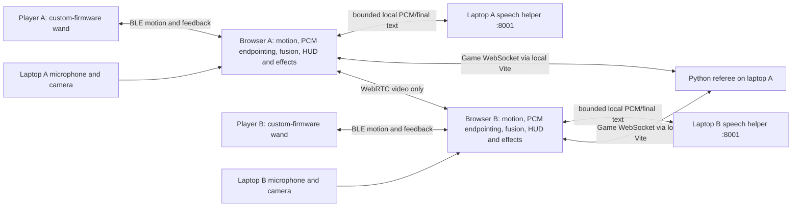

# Harry Potter Battle Simulator — Hackathon MVP

**Experience:** hold your hacker badge like a wand, say a spell, and perform its movement to duel a real opponent through a live-video portal.

**Target:** Hack the North 2026 — Best Badge Hack. **Revised:** September 19, 2026, HAL-grounded custom-firmware handoff. **Repository baseline:** `4a34abd`. This is an implementation plan, not a claim that the proposed voice-and-motion multiplayer experience has been validated.

**Selected build:** one custom-firmware wireless wand per player, direct Bluetooth LE to Windows Chrome, browser-owned motion/PCM endpointing and fusion, a local `faster-whisper` helper on each laptop, one Python referee, WebRTC video and Three.js effects. Two teammates own everything running on the badges; we own everything else. The other two available badges are development/recovery spares, not required receivers.

**Team interface:** [BADGE-FIRMWARE-CONTRACT.md](BADGE-FIRMWARE-CONTRACT.md) defines the required device behavior, proposed v1 wire protocol and integration tests. It is the single source of truth for badge-facing fields; this outline owns gameplay and platform architecture. Both teams must acknowledge the contract before independent implementations freeze it. Until hardware arrives, a protocol-faithful virtual wand lets us develop the complete platform.

**Sai's workspace build/QA skill:** [$wand-dev-workflow](.agents/skills/wand-dev-workflow/SKILL.md) guides repeatable replay, iPhone Safari motion testing over trusted private-LAN HTTPS/WSS and the handoff to real BLE firmware. Its [operating procedure](.agents/skills/wand-dev-workflow/references/workflow.md) includes short human QA cards and explicit timing qualification. Android is not required. The phone path is development-only; the production badge architecture and wire contract stay unchanged.

**Execution plan:** [IMPLEMENTATION-PLAN.md](IMPLEMENTATION-PLAN.md) is the approved complete 0→1 architecture, slice order and gate checklist. The firmware contract/HAL publication is complete at `04e315b`. The Slice 0–1 diagnostic foundation is implemented software-only and its current checks pass; the [replay-only human checkpoint](docs/qa/device-lab-stage-1.md) remains pending. Later game schemas, calibration and Stages 2–9 remain planned.

**Visual system:** [DESIGN_SYSTEMS.md](DESIGN_SYSTEMS.md) defines the original **Wizarding Workshop** for setup/practice and the dark, video-first **Enchanted Mirror** for duels. It changes presentation only; the input contract, mechanics, evidence labels and pending gates in this outline remain authoritative.

## 1. The product decision

The badge is the wand, not a gamepad. **Every spell requires both a spoken incantation and a deliberate badge movement.** The spoken name identifies the spell; the motion verifies that the player performed it. No spell selection, button arming, button release, or instant shield button.

Each player holds a battery-powered badge running dedicated firmware. It streams acceleration directly to their laptop over a custom BLE GATT service. The laptop hears the incantation, combines it with movement, shows the opponent, and renders magic. One match server decides combat results; the laptop sends compact confirmed feedback back to the badge. No cable or second badge is required during play.

This is **dedicated wand firmware plus a computer companion**, not the entire game running inside the badge. Custom firmware removes the stock Lua sandbox; it does not add a microphone, gyro or graphics processor. Keep speech, classification, multiplayer and rendering on the computers.

### What we ship

| Required | Scope |
| --- | --- |
| Physical wand input | Two battery-powered badges with custom firmware; direct BLE acceleration streams; no gameplay buttons |
| Incantation recognition | A tiny spell vocabulary through each player's computer/headset microphone; required for all casts |
| Combat | Stupefy, Protego, then Expelliarmus; health, cooldowns, scheduled impacts, win/draw and rematch |
| Multiplayer | One two-player room at a time; shared authoritative state; opponent live video |
| Presentation | Three.js projectile, shield and disruption effects over a video portal; readable health/cooldown HUD |
| Badge experience | Immediate motion LEDs, identity/connection status, concise spell guide and server-confirmed cast/block/hit/result feedback |
| Setup | Browser-led connection, short calibration, practice and Ready/Rematch controls |

**First playable milestone:** Stupefy versus Protego with real speech and real badge motion on two laptops. **Target completed MVP:** add Expelliarmus and polish those three spells. If only two spells pass the tests, present an explicitly scoped two-spell duel rather than weakening the input contract.

**Effect placement:** fixed anchors over the opponent's video. Camera-based tracking is outside the initial implementation; camera analysis is not a spell input.

Remove mana, extra spells, ultimate attacks, beam clashes, perfect-parry rules, loadouts, chaos/referee badge gameplay and progression. The badge senses motion and presents feedback; it never decides spell validity or match results. Focus on one convincing loop: **say it, move the wand, see the magic, counter the opponent**.

## 2. Player journey: no gamepad controls

1. **Connect.** Power on the wand; dedicated firmware starts automatically. In desktop Chrome, click Connect Wand, choose the Bluetooth device matching its on-screen short ID, and confirm with a movement. Grant microphone/camera access. Show separate wand, microphone, video and server status; never silently select the first nearby device.
2. **Calibrate.** The browser asks for a still grip, then a few gentle examples of the jab, raised guard and sweep. Rehearse each incantation. Calibration and coaching happen on the laptop; no badge menu navigation is required during play.
3. **Join.** Create/join the two-player room and click Ready on the laptop. Both ready starts a shared countdown. The microphone worklet and warm local helper must already be healthy before the countdown completes.
4. **Duel.** Say “Stupefy!” while making a short jab. Say “Protego!” while raising the badge into a guard. Say “Expelliarmus!” while sweeping sideways. Nothing needs to be equipped first.
5. **Recover.** Let the badge settle briefly between movements. That natural reset separates casts; there is no press-to-arm action.
6. **Finish.** Both screens show the same result and a simple landed-spells/blocks recap. Click Rematch on the laptop.

**Badge buttons:** no combat bindings. There is no stock launcher/Home behavior to preserve in replacement firmware. The firmware team may retain a documented maintenance/recovery action; Ready, recalibration and rematch remain browser controls. Development simulation is visibly labelled and prohibited in real-duel rooms; it is not an alternate player input mode.

Use a secure grip and small wrist/forearm movements. The wand uses its supplied two AA alkaline batteries; USB is for approved flashing/diagnostics, not gameplay. No throwing the badge, striking objects, or swinging it by the lanyard. Follow the official power/USB instructions and stop if a device becomes hot or behaves unexpectedly. Custom firmware must preserve safe peripheral/power behavior. [Badge manual](https://badge.hackthenorth.com/manual), [badge safety rules](https://badge.hackthenorth.com/rules)

## 3. Three spells and a small combat engine

All numbers below are starting proposals to tune on physical devices. The game effects are adaptations, not claims of exact fictional canon. [Official spell background](https://www.harrypotter.com/features/the-most-important-spells-harry-taught-da)

| Build priority | Spell and required input | Initial effect | Visual |
| --- | --- | --- | --- |
| **1 — attack** | **Stupefy:** say the name + short jab and settle | 20 damage; 2-second cooldown; initially 2-second projectile travel | Crimson bolt with a spark trail |
| **2 — defense** | **Protego:** say the name + raise badge into a brief held guard | Shield lasts 1.2 seconds, blocks one Stupefy, then breaks; 3-second cooldown | Cyan curved shield with an impact ripple |
| **3 — disruption** | **Expelliarmus:** say the name + lateral sweep and settle | 10 damage and 1-second offensive lockout if unshielded; shield breaks and prevents both effects; 6-second cooldown; initially 2.2-second travel | Red-gold ribbon and a broken-wand status rune |

### Shared rules

- One 60-second round; 100 health each. Zero health loses. At timeout, higher health wins; equal health is a draw. Use the same rules for practice matches and judging.
- No mana system. Cooldowns supply the resource constraint. The HUD shows which spells are available.
- Offense shares a short 600 ms global recovery as well as spell cooldowns. Protego is not blocked by offensive recovery or disarm, but still requires its own voice, movement and cooldown checks.
- All attacks target the opponent. The camera is for presence and effects, not physical hit detection. Leaning out of frame is not a dodge.
- An accepted attack creates a projectile with a future impact time. Damage is resolved at impact against the current shield/status, not immediately on recognition.
- Protego becomes active only when the server accepts the complete voice-and-motion cast. Do not secretly grant a button shield, pre-activate from an unfinished word, or backdate it after an impact.
- Initial 2–2.2-second flight times deliberately accommodate hearing the warning, speaking, gesturing, recognition and network delay. Measure this entire path and lengthen travel if necessary. A visibly defendable duel matters more than artificially fast projectiles.
- Failed recognition or server rejection causes no damage and starts no spell cooldown. Explain the reason briefly on the laptop.
- Disarm blocks new offensive casts only. Already launched projectiles remain. Resolve impacts due in the same server step as a batch; simultaneous knockouts are a draw.
- A disconnected/stale wand, unhealthy local speech pipeline, hidden/suspended game page or lost player game connection aborts the round, clears pending inputs/projectiles and awards no winner. Microphone/audio-helper recovery happens outside play before a fresh Ready; no casts are accepted during an input-health gap. Video-only or badge-feedback-only loss is reported separately: it cannot change health or create a cast.

## 4. Recognizing spells without buttons

**Recognition contract: fresh incantation + compatible deliberate motion = one cast.** Neither input alone is sufficient. No LLM or trained gesture model is needed in the critical path.

### Motion: continuous sensing, bounded gestures

The SC7A20HTR is a three-axis accelerometer, not a position tracker; no gyro is established by the hardware evidence. Rotation changes gravity's contribution, so arbitrary wand-rune reconstruction is out of scope. The stock firmware's 50 Hz cache was a software choice, not a universal sensor limit. The creator HAL supplies a **100 Hz/±2 g bring-up recipe**; our requested **50 fresh samples/second at ±8 g** remains unverified. Prefer verified native 50 Hz; any downsampling design needs joint agreement on timestamps, sequence and loss semantics first. The [contract's sensor appendix](BADGE-FIRMWARE-CONTRACT.md#board-reference-and-sensor-bring-up) defines the readback, signed conversion, six-face and fresh-data tests. [Hardware identification](docs/hardware-verification.md)

**Implementation:** direct BLE notifications carry compact raw acceleration, including gravity, acquisition/read timestamps, sequence, boot identity and validity. The browser owns the single canonical segmenter, calibrated classifier and voice fusion. The wand may compute a lightweight activity indicator, but sends no authoritative spell labels. Calibration and gesture tuning therefore require no firmware rebuild.

Automatically segment movement in the browser using a still baseline, activity threshold, short capture window and settling hysteresis. A first candidate configuration is 200 ms of rest, a 150–900 ms movement, then 150 ms of settling; guard recognition can complete after a short stable raised pose. These are hypotheses, not device-proven thresholds. Require a fresh rest-to-motion transition for the next candidate.

Each sample fits one 20-byte GATT notification at the baseline BLE ATT MTU; no negotiated large packets are required. The browser derives candidates with onset/end and jab/sweep/guard evidence, retaining a short bounded buffer. No application-level replay of old samples, fragmentation or catch-up burst: fresh input matters more than complete history. The contract defines exact units/axes/bytes and loss handling; 50 Hz is an acceptance target, not a measured result.

Calibrate idle noise, grip orientation and safe amplitudes per player in the browser. Use a bounded BLE clock-sync exchange to map device milliseconds into browser time, retaining the uncertainty; do not directly compare clocks. Reject stale samples and reset on stalls/reconnect. Calibration stays browser-local; the referee receives cast requests, not raw samples. A selected BLE connection reduces accidental cross-talk but is not proof of user identity or an anti-cheat system.

The three motions should be deliberately broad. A jab needs an impulse and settling, not accurate forward distance. A sweep needs a lateral burst, not a reconstructed arc. A guard needs a new raising movement followed by a held orientation; holding the same pose cannot repeatedly recast it. If separation is weak, tune those patterns and cut the third spell before adding a machine-learning project.

### Speech: browser endpointing, local transcription

The laptop microphone runs only during explicit practice/countdown/play after permission and a browser interaction. Request a mono track and `new AudioContext({ sampleRate: 16000 })`; setup verifies the actual context rate is exactly 16 kHz and worklet input is mono, otherwise it fails visibly. An `AudioWorklet` owns the PCM frame timebase and voice endpointing; the initial implementation has no application resampler and does not wait for a badge button. A 2-second quiet calibration establishes an idle-only RMS floor, frozen during speech. Start with 60 ms speech-on hysteresis, 150 ms pre-roll, 200 ms end silence, at most 1.8 seconds of active voice and a 3-second hard clip cap. The evidence interval excludes padding.

Each laptop runs its own loopback-only helper at `127.0.0.1:8001`, reached through same-origin `/api/speech/health` and `/api/speech/transcribe` proxies. It keeps one warmed `faster-whisper` `base.en` CPU-`int8` worker with no queue: English, greedy decode, temperature zero, no previous-text conditioning and a fixed three-word glossary. Raw audio stays in bounded memory and never goes to the referee, opponent, cloud or default traces.

Only one unresolved utterance is allowed. A second onset invalidates the attempt and cannot enqueue another inference. Accept only an exact canonical shipped incantation after conservative case/punctuation normalization—no interim result, alias, phoneme/fuzzy match or volume inference. The final must return within 1 second of the unpadded voice end, including browser endpointing; a late worker/result is unhealthy and aborts an active round. If exact names, latency or local-pipeline reliability fail the first physical gate, stop before expanding the game. Do not silently substitute buttons or gesture-only gameplay.

### Pair evidence once, then expire it

The browser owns fusion. Keep one pending attempt per player, using a short rolling gesture buffer and audio/ASR generation-scoped voice intervals. Accept voice before, during or just after the movement so the interaction feels natural; do not require transcription to finish before motion begins.

1. Associate speech with the worklet-derived unpadded voice interval, never the transcription delivery time. Audio generation, utterance ID and returned helper ID must agree. Allow only one unresolved utterance; a second onset or uncertain association invalidates the attempt.
2. Initially allow at most a 350 ms gap between capture intervals, with their combined span no longer than 2 seconds. The final transcript must arrive no later than 1 second after the voice interval ends, in the same audio/ASR generation. A later gesture cannot extend that deadline. Tune these bounds from timestamps and reject ambiguous multiple-motion matches.
3. The recognized spell chooses which movement evidence must pass. “Stupefy” with guard-only evidence is rejected; a spoken name does not merely select a spell for a later unrelated movement.
4. When both inputs pass, consume both IDs and send exactly one session/round-bound cast request. Clear evidence on rejection, timeout, audio/helper generation change, round change, disconnect or page suspension. Require fresh input on return.
5. The server validates spell, player, round, cooldown and duplicates before accepting. Local motion lights can respond immediately, but damage and the full launched spell wait for acceptance.

| What happens | Result |
| --- | --- |
| Correct incantation and matching fresh gesture | One cast request |
| Movement without an incantation | No cast |
| Speech without a deliberate movement | No cast |
| Wrong motion, ambiguous speech or expired evidence | No cast; short coaching cue |
| Repeated transcript or BLE notification | No second cast |
| Camera analysis absent | Casting works; effects use fixed anchors |
| Microphone/worklet/helper unavailable | Do not ready; abort an active round and recover |

**Venue noise is a first-hour risk.** Qualify the planned built-in microphones with placement/separation first; close-talk/headset microphones are a fallback if that setup fails. Default opponent media to video-only for the co-located demo and avoid spoken spell names in game sound effects. Neither local ASR, endpointing nor echo cancellation proves speaker identity: explicitly test an opponent saying each spell while the local player makes its matching movement. If nearby voices still trigger casts, change the physical setup before claiming reliability.

## 5. Wireless badge integration and computer access

**Hardware grounding:** the [unchanged creator-supplied HAL](docs/hardware/custom-firmware-hal.md) identifies ESP32-C3-MINI-1-N4, 4 MB flash, SC7A20HTR, a 320×240 ST7789 display and six WS2812 LEDs. Provenance and SHA-256 are recorded in the [firmware contract](BADGE-FIRMWARE-CONTRACT.md#2-hardware-facts-versus-requested-behavior). Espressif documents a single-core processor up to 160 MHz, 400 KB total internal RAM, Wi-Fi and Bluetooth LE. Total chip RAM is not free application heap. The old ~78 KB free-heap / BLE-startup measurements describe the stock image, not the replacement firmware's budget. Creator documentation, manufacturer capabilities, project targets and hardware measurements remain separate evidence categories. [Measured board identity](docs/hardware-verification.md), [Espressif specifications](https://www.espressif.com/en/products/socs/esp32-c3)

The creators advised replacing the Lua runtime; Sai has now supplied their custom-firmware HAL directly. Use its pin table and bring-up guidance with the contract's qualifications, not old Lua API names. The firmware teammates own board support, language/SDK, drivers, scheduling, memory, power and recovery. ESP-IDF 5.5.3 is the creator-documented bring-up baseline, not a blanket known-good claim: record the exact SDK/configuration and the NimBLE flow-control mitigation in the contract. A patched SDK is an explicit firmware-owner decision followed by regression testing.

**Selected transport: custom BLE peripheral → Windows laptop's Bluetooth adapter → Chrome Web Bluetooth. SDK-supported, badge-unvalidated.** One device connection per player, standard GATT reads/notifications/writes, no badge gateway, BLE-native helper or badge Wi-Fi provisioning. The separate loopback speech helper has no badge role. The creator's proven extended-advertising/passive-scan pattern does not qualify connected GATT. Use the contract's [minimal peripheral build](BADGE-FIRMWARE-CONTRACT.md#3-wireless-connection-and-gatt-surface) and [H0–H4 gates](BADGE-FIRMWARE-CONTRACT.md#8-acceptance-and-handoff-checklist) early: both subscriptions, actual motion and feedback together, measured memory/timing, reconnect and AA power. No scanning, NFC initialization or optional radio roles. A receiver bridge or Wi-Fi would add dependencies; neither is built in parallel. If the minimal connected build fails, return measurements and jointly revise the contract, never silently substitute transport. [Chrome GATT support](https://developer.chrome.com/docs/capabilities/bluetooth), [Espressif peripheral example](https://github.com/espressif/esp-idf/blob/v5.5.3/examples/bluetooth/nimble/bleprph/README.md)

### Installation versus gameplay

- Firmware teammates deliver the contract's release manifest: exact SDK/configuration, board revision, partition CSV/summary, every artifact's hash/offset, preservation and stable-identity policy, creator-confirmed USB/AA power state, backup and known-good recovery procedure/image. Stock restoration is promised only with an available stock image or approved backup procedure. Demonstrate actual USB-Serial-JTAG/Start-GPIO9 recovery; do not infer flash offsets from HAL shorthand. Flashing requires separate approval per device; no blanket erase, eFuse changes or automatic flashing is authorized.
- The stock Lua web IDE is neither the replacement-firmware installer we rely on nor a gameplay proxy. USB flashing/debug tooling belongs to the firmware team's runbook. Gameplay starts from battery boot and uses Bluetooth only.
- Each player clicks Connect Wand from the default `http://127.0.0.1:5173` frontend, selects the advertised ID and completes a version/identity/stream handshake. A browser chooser grant is not authenticated pairing. Restrict to our service; confirm the short ID visually and by movement.
- Reconnect reacquires GATT characteristics, establishes a new link session, synchronizes clocks and clears old evidence. No automatic continuation of an interrupted round. A missing/incompatible adapter or protocol is a visible setup failure, not a silent fallback.

### What appears on the badge

| Local state | Screen | LEDs |
| --- | --- | --- |
| Not connected / stale link | Short device ID, firmware version, connection/error state | Neutral/amber, never a stale victory cue |
| Connected / practice | Three short spell/movement cues; “Say the spell and move” | Bounded immediate activity glow |
| Server-accepted spell | Brief corresponding spell cue | Crimson attack / cyan guard / gold disruption |
| Server-confirmed block / hit / result | Latest confirmed HP/phase, brief event cue | Block ripple / hit flash / result pattern |

The browser maps authoritative game events to a tiny vocabulary of state/cue commands; firmware chooses the efficient visual implementation. No per-frame RGB stream, downloaded textures, audio, cooldown simulation or physics on the badge. Feedback commands expire and deduplicate; a dead host clears match feedback. Local activity remains visibly different from confirmed casting. Start with status text and simple pulses; graphics polish must not disrupt sampling. Feedback is an output, never an acknowledgement required to resolve damage.

## 6. Visual experience and assets, in build order

Use the bright, card-based Wizarding Workshop to guide setup, calibration and practice; use the dark Enchanted Mirror only once combat begins. Keep the opponent large inside that mirror, with a small self-preview. Opponent health sits above the portal, own health below, and three cooldown indicators remain readable. During training, show “heard spell” and “detected movement”; hide diagnostics during the duel. Shared tokens, component states and originality rules live in [DESIGN_SYSTEMS.md](DESIGN_SYSTEMS.md).

| Priority | Asset | Minimal approach |
| --- | --- | --- |
| 1 | Three spell glyphs, gesture cues, health/cooldown/result UI | Original line art reused on badge and browser; DOM/CSS HUD |
| 2 | Stupefy | Emissive bolt, short trail, pooled impact sparks |
| 3 | Protego | Transparent curved surface, glowing rim, impact ripple |
| 4 | Expelliarmus | Reuse projectile plumbing; twisting gold/red ribbon and brief status rune |
| 5 | Portal and sound | Procedural frame; restrained glow; original/licensed incoming, cast, block, hit and result sounds |

Use one transparent Three.js canvas over a normal opponent video element, with fixed spell origins. On the attacker screen, the bolt travels toward the opponent; on the defender screen, it approaches the camera and strikes the foreground shield. Both animations refer to the same server projectile and impact time. No video-textured mesh, hand tracking or camera hit detection in the initial build.

The showcase is a spoken Protego plus raised badge producing a shield that visibly catches a real opponent's Stupefy. Build that moment before decorative environments. Cap particles and pixel ratio, preload audio, and preserve at least 30 fps on both demo laptops; aim for 60 only after input is stable.

## 7. High-level architecture

Each browser connects to only its player's wand. Firmware and platform meet at the versioned GATT contract, not at shared implementation code. During development, a virtual wand replaces that endpoint; the decoder and all downstream platform behavior stay unchanged.

| Layer | Decision |
| --- | --- |
| Badges — firmware team | Two instances of dedicated firmware: fresh acceleration, BLE connection, bounded feedback, diagnostics; no combat authority |
| Frontend — our team | Existing React + TypeScript + Vite; Windows Chrome; Web Bluetooth; AudioWorklet PCM/endpointing; local fusion; plain Three.js |
| Speech helper ×2 — our team | Loopback-only Python helper on each laptop; warmed `faster-whisper base.en` CPU-`int8`; one bounded inference worker, no cloud and no queue |
| Referee | Existing Python + FastAPI + Pydantic patterns; one two-player room; deterministic rules |
| Game transport | Session-bound WebSocket inputs/events/snapshots, around 20 Hz server updates |
| Media | Browser camera capture and WebRTC opponent video; audio chat omitted from the demo |
| Storage | In-memory match state and browser-local calibration; no accounts or database |

The server assigns player slots and opaque session tokens; it must not trust the badge's old self-declared P1/P2 labels or client-proposed damage. Input IDs are bound to connection/session and round. Local recognition is still a prototype trust boundary, not an anti-cheat system.

Use server time for impact/cooldown deadlines. Clients estimate clock offset for animation but cannot backdate cast requests. Bounded per-client outbound queues prevent one slow browser stalling combat. Reconnect starts a fresh round; no persistence/resumption system is required.

**Demo network:** both laptops on a controlled hotspot/LAN, each serving its default frontend at `http://127.0.0.1:5173`. The two Vite processes proxy game traffic to one session-protected Python referee on laptop A; WebRTC carries video separately. Section 13.4 specifies launch and security boundaries. Public hosting and a TURN relay are outside the initial implementation.

Camera/microphone and Web Bluetooth need appropriate secure contexts. A frontend served over another machine's plain HTTP address is not equivalent to the exact loopback origin. WebRTC still needs signalling; STUN is not a guaranteed relay. [Camera requirements](https://developer.mozilla.org/en-US/docs/Web/API/MediaDevices/getUserMedia), [WebRTC connectivity](https://developer.mozilla.org/en-US/docs/Web/API/WebRTC_API/Protocols)

No recording by default. Show when the microphone is listening and that transcription is local, and stop the worklet/media tracks on leave. Limit diagnostics to short opt-in captures; do not retain raw voice/video or transcripts for match history.

## 8. Build an isolated duel path alongside the current project

The existing Phantom Arena uses local radio badges, a gateway, a Python referee and a passive browser viewer. Reuse useful infrastructure, not its control model.

| Existing source | Revision |
| --- | --- |
| [badges/phantom_player.lua](badges/phantom_player.lua), [phantom_gateway.lua](badges/phantom_gateway.lua) | Legacy reference only; no new Lua work. Firmware team owns replacement image; platform does not depend on these apps |
| [game.py](apps/host/phantom_host/game.py) and [contracts.py](apps/host/phantom_host/contracts.py) | Reference deterministic/testable patterns only. Build a new isolated duel engine/contracts; do not adapt the legacy button/mana rules |
| [main.py](apps/host/phantom_host/main.py) and [broadcaster.py](apps/host/phantom_host/broadcaster.py) | Keep the legacy viewer path separate; add isolated duel routes/session handling and bounded state delivery in the existing Python/FastAPI stack |
| [App.tsx](apps/web/src/App.tsx) and [ArenaStage.tsx](apps/web/src/components/ArenaStage.tsx) | Add BLE/virtual transport seam, explicit wand binding, motion classification, mandatory speech fusion, setup/practice and the Three.js stage |
| [vision.py](apps/host/phantom_host/vision.py) | Remove host-camera/base64-JPEG snapshots from the new mode; browsers own camera capture and WebRTC |
| [badge_monitor.py](tools/badge_monitor.py) | Historical USB bring-up reference, not a runtime dependency or direct BLE validator |
| [apps/host/tests](apps/host/tests/) and [fake_gateway.py](tools/fake_gateway.py) | Reuse deterministic/replay testing patterns, not the old preclassified cast packets or macOS/POSIX PTY simulator. Add browser-native byte fixtures and fault injection |

Leave unrelated legacy files intact while the new path is built. Disable the old serial gateway, camera worker and AI director for this mode; each browser owns its BLE device and camera. Do not turn existing legacy tests green by preserving obsolete button-cast behavior in the new duel.

The [hardware report](docs/hardware-verification.md) records one badge's identification, USB bring-up and stock-firmware BLE memory failures. Its Lua limits, test counts and pre-flight checklist are historical, not custom-firmware acceptance results. Direct GATT, battery endurance and the voice-and-motion duel remain unverified.

The current repo now contains the isolated Slice 0–1 diagnostic shell, Device Lab/protocol/virtual-device foundation and fake-BLE lifecycle work. Keep the changing commands/counts and exact implemented boundary in the [current checkpoint](docs/qa/device-lab-stage-1.md). Its replay-only human card remains pending. Calibration UI belongs to Stage 3; cross-language game/event fixtures and the real referee/socket contract belong to Stage 4. Browser speech fusion, WebRTC player video, Three.js, iPhone/Windows qualification and real badges remain later gates. Foundation checks do not establish the end-to-end experience.

## 9. Build order and hard scope gates

Work in parallel against the firmware contract; do not wait for a finished badge to start the game. Recalculate remaining hackathon time when work starts; the milestones below define dependency order, not a fresh full-day budget.

| Order | Milestone | Gate before expanding |
| --- | --- | --- |
| **Current checkpoint** | Slice 0–1 isolated diagnostic shell, byte core, virtual/fake BLE and Device Lab | Current foundation checks pass; complete the replay-only human card without selecting the BLE chooser |
| **Input risk gates** | Stage 2 local ASR, then Stage 3 calibration/classifier/fusion | Exact core words and latency qualify on real laptop microphones; correct positive/negative fusion with no stale attempt |
| **Badge-free core** | Stages 4–8: Stupefy/Protego sockets/referee, one-phone then two-person flow, video, graphics, and conditional Expelliarmus | Complete labelled simulated/surrogate duel, defenses, cross-talk, performance, recovery and five-match gates |
| **Windows surrogate freeze** | Stage 9 on two Windows x64 Chrome laptops with two iPhones | Five uninterrupted matches and judge rehearsal, explicitly labelled `PHONE SURROGATE`; mechanics/runbook freeze |
| **Separate badge handoff** | After the surrogate freeze, swap transports only and execute contract H0–H5 | Recovery, sensor truth, Windows GATT, combined load, two-badge/endurance and full real-input gates; no gameplay rewrite |

Firmware teammates may develop **device/driver bring-up** and **BLE/feedback/recovery** in parallel while our team completes the surrogate platform, but H0–H5 remains a separate post-freeze handoff/acceptance stream. Our team owns **device adapter + test harness**, **recognition/fusion**, **referee/network/video**, and **UI/Three.js**. Mac bring-up can supply early diagnostics, but the intended Windows Chrome/adapters require their own H2–H4 qualification and H5 retains the full two-badge, endurance and gameplay tests. Do not let effects work delay speech qualification.

If speech latency is high, lengthen projectile warning/travel and simplify endpoint/model settings within the locked local design; do not make speech optional. If the third gesture is weak, ship two spells. If core wireless/speech input remains unreliable, state that limitation and demonstrate labelled training evidence—do not claim the specified MVP is complete.

## 10. Acceptance tests that define a working demo

These are proposed gates, not results already obtained.

| Test | Target |
| --- | --- |
| End-to-end recognition | Each player performs 20 attempts per shipped spell; initially at least 18/20 correct fused casts, with confusion/rejection counts recorded |
| False casts | Zero accepted casts in explicit speech-only, movement-only, mismatched, idle/fidget and nearby-opponent-speech trials; include at least two minutes of idle/conversation |
| Temporal safety | Duplicate transcripts/packets, delayed final results, back-to-back attempts, a held guard, reconnect and old-round input never cause a second or stale cast |
| Responsiveness | Local motion cue aims below 100 ms. From completion of raw paired capture, `max(voiceEnd, motionEnd)`, to authoritative server acknowledgement aims below 750 ms p95, including endpointing, local ASR, fusion and network. Measure the full incoming-warning-to-accepted-Protego path |
| Defendability | At least 8/10 deliberate defenses land before impact in a rehearsed attack/guard test; tune warning/travel time without accepting shields retroactively |
| Combat | Server rejects cooldown violations; shield/disarm rules and simultaneous impacts are deterministic; both views agree on health |
| Wireless isolation | Each browser selects the correct stable wand ID; one central per wand; room rejects duplicate wand assignment |
| Firmware contract | H0–H5 evidence; verified native signed decoding and 50 Hz/±8 g profile, byte/axis tests, connected Windows GATT, combined-load and two-wand soak; no stale feedback after link loss |
| Recovery | Power off wand, disable Bluetooth, stop the worklet/helper, hide/close browser or lose server; abort clearly, clear all evidence, and restart cleanly |
| Sustained demo | Two people finish five matches with clean rematches; no service restart; at least 30 fps on each laptop |

Checks still required: custom-firmware boot/recovery, direct Windows BLE, two simultaneous battery-powered wands, timing under screen/LED load, grip-specific sensor noise, microphone isolation and local-ASR behavior under venue noise. Passing virtual-device tests cannot substitute for these measurements.

## 11. Judging and delivery

### A 90-second demonstration

1. **0–15 s:** show the badge and both live-video portals: “This is our wand. No combat buttons—every spell needs the word and the movement.”
2. **15–30 s:** demonstrate Stupefy. Briefly show that saying it without moving does not cast.
3. **30–45 s:** opponent says Protego and raises their badge; the incoming bolt hits the shield.
4. **45–70 s:** use Expelliarmus if shipped, exchange spells, and let the 60-second round end by knockout or timeout.
5. **70–90 s:** show the shared result, rematch control, and the two evidence indicators; explain what runs on the badge versus the laptop.

The published event rules separate initial prize selection from final project editing: initial submission, team/badge IDs and selected sponsor prizes by **September 19, 2:00 PM EDT**; final editing by **September 20, 8:00 AM EDT**. Verify the saved Best Badge Hack selection immediately. If the earlier cutoff has passed, confirm eligibility with organizers rather than assuming final editing restores it. This plan does not submit anything for the team. [Event rules](https://hackthenorth2026.devpost.com/rules), [prize listing](https://hackthenorth2026.devpost.com/)

Keep the story focused on the badge's meaningful contribution: an untethered motion-sensing wand with custom firmware and responsive, confirmed physical feedback. The laptop supplies hearing, multiplayer and spectacle. Success is a reliable spoken-and-gestured duel, not using every peripheral.

## 12. First implementation checkpoint

**A player says “Stupefy” and jabs their real badge; a remote player sees the incoming spell, says “Protego” and raises their real badge; the shield blocks before impact, and both computers show the same health. No gameplay button is pressed.**

Everything in the build should either prove that interaction, make it reliable, or make it look and feel magical.

## 13. Technical implementation blueprint and joint development workflow

This is the **selected initial implementation after the custom-firmware pivot**. Device-independent platform work starts immediately; hardware acceptance remains a separate gate. The firmware contract is a proposed team agreement, not evidence that a compatible image already exists.

### 13.1 Component ownership

| Component | Build and responsibility |
| --- | --- |
| **Dedicated wand firmware ×2 — teammates** | Fresh acceleration, BLE GATT endpoint, stable identity/health, small expiring feedback vocabulary, battery boot and recovery. No spell classifier or combat rules |
| **Device boundary — our team** | One `WandTransport` interface with real Web Bluetooth and virtual implementations. Shared binary decoder/encoder, handshake, clock mapping, liveness and command queue; no BLE API calls in game/render code |
| **Browser input pipeline ×2 — our team** | Validated samples → calibration/segmentation → gesture evidence; AudioWorklet PCM/timebase → browser endpointing → local final speech evidence. Scripted fixtures preserve the same IDs/intervals/generations; one fusion implementation consumes one matching pair |
| **Local speech helper ×2 — our team** | Fixed loopback `127.0.0.1:8001`; warmed `faster-whisper base.en` CPU-`int8`; one bounded request/worker and no queue, cloud call, microphone ownership or match state |
| **React + TypeScript + Vite ×2** | Connection/binding, practice, Ready/Rematch, HUD and diagnostics. Use the existing project and lockfile |
| **FastAPI + Pydantic referee ×1** | A new isolated duel engine in the existing Python/FastAPI/Pydantic stack: two player sessions, validated casts, deterministic deadlines/impacts, state and signalling. Do not adapt the legacy button/mana rules |
| **WebRTC + plain Three.js ×2** | Video-only opponent feed, fixed-anchor effects and server-driven animation. No camera inference, audio chat or physics engine |
| **State** | In-memory room; browser-local calibration keyed to wand/grip. No database, accounts, recording or persistent match recovery |

Keep sample/audio/render loops outside React state; publish UI transitions and bounded diagnostics. Only the referee owns health, cooldowns and impacts. Firmware receives a spell code solely for presentation after acceptance, not the microphone transcript or the authority to cast.

### 13.2 Device boundary: one real adapter, one faithful simulator

`WandTransport` exposes connect/disconnect, read device info/status, subscribe to raw motion/status bytes, write command bytes and connection events. `BleWandTransport` maps those operations to GATT; `VirtualWandTransport` implements the same endpoint behavior in browser memory. The shared `WandClient` above either adapter handles protocol validation, sessions, sync and feedback. The simulator must not inject a convenient `spellCast` directly into live gameplay.

For human testing before firmware arrives, the [workspace workflow skill](.agents/skills/wand-dev-workflow/SKILL.md) permits a dev-only WSS carrier to the same virtual endpoint core running in iPhone Safari. The optional phone-QA profile adds trusted LAN HTTPS with explicit setup approval; ordinary laptop-only development stays on exact loopback `127.0.0.1`. It uses real acceleration but remains labelled surrogate input, with its own calibration and measured timing qualification. It cannot qualify BLE or badge sampling and is never enabled in real-duel mode.

The [firmware contract](BADGE-FIRMWARE-CONTRACT.md) specifies four small characteristics and 20-byte records; this HAL revision does not change their bytes, UUIDs or golden vectors. Request 50 Hz/±8 g acceleration with gravity, boot/sequence/capture time, bounded latency and explicit sensor validity. Device Lab may inspect a truthfully advertised 100 Hz/±2 g or incomplete bring-up image, but it remains unsupported for casting and cannot enter real-duel Ready. The return path sends coalesced match state and one-shot cues; it does not stream animation frames. Latest state wins, cues expire, and feedback never blocks the referee or motion processing.

At connection, match device ID to the screen, validate protocol/capabilities, establish a fresh link nonce, synchronize clocks and collect a stable baseline. Reserve the device ID with the referee before Ready. Browser permission IDs/MAC addresses are not the cross-platform identity contract. Reconnect/boot change flushes pending input and requires a new round.

Reject malformed, duplicate, out-of-order, clipped, invalid or stale samples. Start with a maximum 150 ms gap inside a gesture and abort after 500 ms without fresh valid motion. Detect browser event-loop stalls/page hiding independently: freshly delivered buffered notifications are not necessarily fresh measurements. The precise thresholds, clock-uncertainty gate and no-backlog rules live in the contract so firmware, simulator and platform cannot quietly diverge.

Direct GATT must be qualified early on the real Windows Bluetooth adapters. No packet-size arithmetic or browser feature detection proves radio latency; physical acceptance includes simultaneous two-wand traffic with LED/display feedback enabled.

### 13.3 Voice, motion and fusion

**Selected recognizer:** browser-owned PCM timing/endpointing plus a local per-laptop `faster-whisper base.en` CPU-`int8` helper. The browser requests a mono 16 kHz `AudioContext`, verifies the actual rate/input channels, and fails setup if unsupported; there is no initial application resampler. It uses 2 seconds of quiet calibration and the 60 ms start / 150 ms pre-roll / 200 ms end / 1.8-second voice / 3-second clip bounds in Section 4. The helper is English, warm, greedy, temperature zero, no previous-text conditioning, exact canonical vocabulary, one worker and no queue. No Web Speech, cloud ASR, automatic aliases, interim casting or phoneme/fuzzy matching. Qualify both players' Stupefy and Protego before effects; add Expelliarmus only after those work.

The browser handles per-grip stillness calibration, broad jab/raised-guard/sweep evidence and the single-use pairing rules in Section 4. Maintain one unresolved utterance and one attempt. A second speech onset invalidates the pending attempt and cannot create a second queued job; conflicting finals, ambiguous capture timing or multiple matching motions also reject. Use worklet frame-derived voice boundaries, not helper result delivery time.

**Timing:** voice and motion intervals may overlap or have a gap of at most 350 ms; their union must be at most 2 seconds. The final transcript must arrive within 1 second of the unpadded voice interval ending, in the same audio/ASR generation, including endpoint silence and inference. Expire and consume evidence once; do not stretch windows to hide latency.

**Lifecycle and privacy:** `/api/speech/health` must show the fixed loopback helper loaded, warmed and idle before Ready. Microphone/worklet/helper generation changes clear pending evidence. Any active-round loss or late worker aborts with no winner; recovery occurs before a fresh Ready, not through pause/resume. Audio remains bounded in memory and never reaches the game server, opponent, cloud, logs or default traces.

**Built-in microphone setup:** start with video-only peer media, muted laptop speakers, each laptop near its own player and practical separation. Test an opponent saying each spell **while the local player performs its matching gesture**: zero accepted casts in 10 trials per shipped spell/player. Local ASR and echo cancellation cannot identify the speaker. If separation fails, change seating or use close-talk microphones; if local recognition itself fails, stop before further implementation. No speech-optional fallback.

### 13.4 Windows launch, multiplayer and video

Each laptop runs its own Vite frontend on the exact default origin `http://127.0.0.1:5173`, opens it in Chrome and runs its own speech helper on fixed loopback `127.0.0.1:8001`. Only laptop A runs the game referee. For the two-laptop demo, bind the referee to A's selected private IPv4 on port 8000 and point both Vite game proxies at that address; each Vite speech proxy still points to its own loopback helper. Use `/api/game/*` and `/ws/game` for the referee, `/api/speech/{health,transcribe}` for local ASR, and `/ws/dev-wand` only for the development phone relay. Both browsers use same-origin paths. Keep Vite loopback-only outside the approved phone-QA profile. [Existing proxy](apps/web/vite.config.ts), [socket hook](apps/web/src/hooks/useArenaSocket.ts)

**Development-only exception:** the approved iPhone phone-QA profile in the [workflow skill](.agents/skills/wand-dev-workflow/SKILL.md) serves Vite on a selected private interface over trusted HTTPS/WSS. This does not change the real-badge demo topology above or authorize network/trust changes by itself.

Before LAN use:

- Disable the old host serial gateway, host-camera worker and AI director in the new mode; the browser owns BLE and camera.
- Use one room with a join code, two opaque player tokens and no third player. Authenticate the first bounded WebSocket message, validate its `Origin`, and protect/remove the old unauthenticated reset route. Tokens never enter URLs or logs.
- Use a controlled private LAN without client isolation. Runtime speech stays local and needs no cloud connectivity. Obtain approval for any narrowly scoped Windows firewall exception; never disable the firewall. This local HTTP/WS topology is not public hosting.
- The speech helper binds only loopback. Its Vite proxy checks raw peer and exact Origin, rejects the phone/LAN peer, caps the body, ignores forwarded-address headers and adds a per-run secret that is never bundled or logged. Raw audio is not forwarded to the referee.
- Record exact Node/Python/Chrome/Windows versions, ASR model/settings and Bluetooth adapter/driver; use locked dependencies and provide explicit Windows launch configuration. Creating a `.env` file alone does not mean Python loads it. Reject missing Web Bluetooth, AudioWorklet/microphone or warm local ASR with a setup explanation.
- Expose Disconnect Wand; detach listeners and release GATT before firmware maintenance. Reconnect rediscovers services instead of reusing invalid characteristic objects. Firmware updates may require clearing an OS GATT cache; the team must document the tested recovery, not ask users to toggle random flags.

Use one video-only `RTCPeerConnection` per player, initially 720p at 30 fps with a 480p low preset. Use the perfect-negotiation pattern with an assigned polite role; authenticate and generation-scope signalling, queue ICE until the remote description exists, and mute self-preview. **Vite carries signalling, not video.** Verify direct peer media on the actual LAN; a working game socket does not prove video connectivity. No public server or TURN service is included.

### 13.5 Contracts and deterministic combat

| Boundary | Minimum contract |
| --- | --- |
| Wand ↔ browser | Contract v1: info, motion, commands and status; device ID, boot ID and link nonce; simulator uses identical bytes |
| Motion / speech → fusion | Unique evidence IDs, source generation, capture interval, gesture evidence or final canonical incantation |
| Browser → referee setup | Register input mode, selected stable device ID, boot ID and local input generation before Ready; reserve device ID to one player. Binding/mode changes clear readiness and evidence; identity is not authentication |
| Browser → referee play | Authenticated player/session, round, input/attempt ID, spell and evidence IDs; immediate input-health transitions |
| Referee → browsers | Round ID, state version, server time; immutable action/projectile/effect IDs; accepted/rejected action, scheduled impact, HP/status/cooldown deadlines and result |
| Browser → badge presentation | Project the latest authoritative state and deduplicated accepted/hit/block/result events into expiring feedback commands; never send pre-acceptance combat success |
| Peer signalling | Authorized opponent, connection generation and SDP/ICE |

Three relevant clocks remain distinct: wand capture time, browser capture/fusion time and server combat time. BLE round-trip sync maps motion; server clock estimates drive animations. Neither permits retroactive casts. Add game-connection liveness (initially 500 ms heartbeats, 1.5-second timeout) so abrupt browser loss aborts even when no clean socket-close event arrives.

One referee state writer orders validated commands by server receipt alongside scheduled impacts. A guard received at 1,980 ms beats an impact due at 2,000 ms even if both are processed on a 2,020 ms tick; a guard received at 2,010 ms loses. Equal-time guard/impact is impact-first; simultaneous impacts are batched before deciding a winner. No client-proposed damage or offline cast replay.

Keep socket writes outside simulation updates. Bound per-client queues, coalesce snapshots, deduplicate action effects and disconnect persistently slow clients. Do not retain the existing broadcaster's ability to delay the simulation while awaiting a slow socket.

Assign each action/projectile/impact-effect a stable per-round ID, preserved across repeated delivery and snapshots. Browsers keep bounded per-round seen-effect IDs: the same hit/block/result cannot replay its Three.js animation, sound or badge CUE. Old-round events are discarded; snapshot state updates do not recreate historical one-shot effects. Badge command sequences deduplicate BLE writes, not server events re-encoded as new commands, so both boundaries need this protection.

### 13.6 Build and test continuously without badges

**First platform deliverable: a Device Lab page.** Select Virtual or BLE, inspect identity/boot/session, view x/y/z and sample age/loss, run calibration, see speech/gesture/fusion decisions, send feedback and view its acknowledgement. The virtual wand includes a tiny screen/LED preview driven by the **decoded outbound commands**, not directly by game state. This tests both sides of the boundary.

| Test layer | What we build/test now | What it does not prove |
| --- | --- | --- |
| Protocol conformance | Golden byte vectors shared with firmware; decoder/encoder tests for signed axes, exact lengths, versions, flags, wraps and state/cue expiry. Virtual endpoint implements info, subscriptions, OPEN/SYNC, command ACKs and disconnect | Actual BLE discovery, OS permissions, radio timing or physical LEDs |
| BLE adapter lifecycle | Fake Web Bluetooth API tests exercise the real adapter: chooser cancellation, missing service/characteristic, subscription failure, serialized writes, disconnect during operations, listener cleanup and late callbacks from an old connection | Actual Windows chooser, Bluetooth driver or radio; those still need G2 |
| Motion + fusion | Seeded synthetic rest/jab/guard/sweep **sample traces**, replay clock and speech lifecycle fixtures. The same production classifier/fusion sees them; inject duplication, loss, jitter, delayed finals, reboot and stale buffered samples | That synthetic gestures resemble a person's badge motion; real traces replace/tune these fixtures later |
| Real microphone, virtual motion | Sai triggers a replayed movement while actually speaking, then tests speech-only/mismatch/nearby-speaker cases through the real worklet and local helper | Real speech-to-physical-motion alignment or classifier accuracy |
| Referee | Fake-clock Python tests: cooldowns, queued impacts, simultaneous knockout, disconnect, old rounds, duplicate attempts, slow clients, rematch; schema/enum fixtures checked on both TS/Python sides | Wi-Fi performance or human defendability |
| Two browser clients | Automated dev-room duel through virtual raw inputs, real sockets/referee and real UI; assertions on health/result/effect IDs. Separate browser contexts, synthetic media if needed | Real camera permissions, microphone isolation or Windows BLE |
| Two actual laptops | Real camera/WebRTC/LAN, real microphones, virtual wands; capture frame rate, network loss/rejoin and speech latency independently | Hardware gesture accuracy, radio coexistence or battery endurance |

Use [Vitest with fake clocks](https://vitest.dev/guide/mocking/timers) for protocol/classifier/fusion, pytest for the referee and local helper, and [Playwright/Chromium with isolated client contexts](https://playwright.dev/docs/browser-contexts) for repeatable two-client flows. Slice 0–1 has the minimum web/browser tooling; keep its changing commands/counts in the [current checkpoint](docs/qa/device-lab-stage-1.md). Keep wand simulation browser-native so Windows needs no PTY or virtual COM driver; the one intentional local service is the later fixed-loopback speech helper. Automated fixtures cannot replace real microphone plus local-ASR qualification in the actual Chrome installation.

**Fault scenarios:** malformed/unsupported packets; negative axes; sequence/timestamp wrap; reboot with sequence reset; 100/200/600 ms gaps; stale data delivered in a burst; page suspension; failed GATT writes/missing ACK; duplicate/expired cues; old-session writes; PCM gap, second onset, late ASR result or helper generation change; server loss during an incoming attack; duplicate wand binding; rematch while old packets arrive. Tests assert **no stale cast or repeated feedback**, not just no exception.

**Simulation isolation:** an explicitly enabled server-side development mode permits virtual or mixed inputs; every client gets a permanent SIMULATED/MIXED banner. Real-duel mode has no simulator controls and refuses clients declaring virtual input. Lock input mode at room creation; switching requires leaving and creating a fresh room, clearing evidence. This prevents accidental demonstration claims, not a malicious client's forged identity. Direct cast injection is allowed only in isolated engine/visual tests, never as the claimed end-to-end test.

Use bounded, opt-in trace export with protocol version, build, source mode, samples, relative timings, lifecycle transitions and canonical evidence IDs. Default traces omit raw audio/video, transcripts, room tokens and personal IDs. Replaying a physical failure through the same decoder/classifier becomes a regression test. Record whether every result is synthetic, real speech + virtual motion, real single-wand, or real two-player.

### 13.7 Parallel delivery and human QA gates

| Gate | Our platform work | Firmware / Sai contribution | Exit evidence |
| --- | --- | --- | --- |
| **G0 — diagnostic foundation** | Isolated duel shell, protocol/virtual/fake BLE and Device Lab diagnostic | Sai runs the replay-only Slice 1 card; no BLE chooser or physical claim | Current foundation checks plus jab, feedback-expiry, 600 ms outage/reconnect and source-label evidence |
| **G1 — input qualification** | Mono 16 kHz local ASR, gesture calibration/classifier and mandatory fusion | Sai tests real microphone positives/negatives; no iPhone required yet | Core words/latency pass; one matching fresh pair produces one attempt; motion/speech/mismatch negatives produce none |
| **G2 — badge-free playable** | Real decoder/fusion/referee, ordinary scripted second client, video and minimal Stupefy/Protego | Sai completes one-iPhone and then two-human/two-iPhone cards | Deterministic duel plus measured surrogate timing, nearby-speaker and recovery evidence, clearly labelled |
| **G3 — visual/performance core** | Server-time Stupefy/Protego effects, HUD, low-quality fallback and conditional third spell | Sai runs defense, performance and SFX microphone cards | At least 8/10 defenses; stable ten-minute render; no stale/repeated effects or microphone regression |
| **G4 — Windows surrogate freeze** | Run/freeze the complete candidate on two Windows x64 Chrome laptops | Two people, two iPhones, local ASR/cameras and judge rehearsal | Five uninterrupted matches, clean rematches, at least 30 fps and documented limits, labelled `PHONE SURROGATE` |

Firmware development may run in parallel, but contract H0–H5 is a separate hardware handoff after the G4 surrogate software freeze; it is not a prerequisite for the two-iPhone/Windows checkpoint. That later handoff swaps transports, creates badge-specific calibration and qualifies recovery, actual sensor/profile, Windows GATT, combined load, two-badge endurance and real feedback without changing gameplay. The firmware contract/HAL publication is complete at `04e315b`. The Slice 0–1 diagnostic foundation exists and its [replay-only human card](docs/qa/device-lab-stage-1.md) is the current open gate.

Use one coherent slice → automated checks → fresh review → a short human test card → measured fix → next gate. Cards identify build/firmware, input mode, preconditions, 3–5 actions, expected response and stop condition. The agent implements/replays/inspects software; humans select devices, grant permissions, speak, move, flash with approval and assess playability. If local ASR or BLE is blocked, continue only independent work that does not conceal the blocked gate; do not change gameplay semantics to hide it.

The training panel shows device/boot/link identity, sample age/loss, clock uncertainty, firmware health, gesture, canonical heard word, PCM/endpoint/helper state, rejection reason, request latency, feedback ACK and video status. Correlate boot/sequence → evidence → attempt → server action → feedback command. Keep logs bounded and never log audio, transcripts, helper secrets or session credentials.

### 13.8 Scope lock and next checkpoint

Build the **Stupefy-versus-Protego platform against the contract first**, then qualify it with real wireless wands. Do not build firmware on behalf of the two teammates, a second production badge transport, optional-speech gameplay or extra mechanics. The bounded phone/replay harness is development-only. Custom firmware enables a cleaner interface; it does not eliminate hardware testing.

Next: complete the Slice 0–1 human-QA checkpoint in [IMPLEMENTATION-PLAN.md](IMPLEMENTATION-PLAN.md); Stage 2 local ASR follows when that gate passes. The full plan is approved—the checkpoint is procedural, not a claim that only Slices 0–1 were requested. Later implementation follows those QA gates; commit/push, device flashing, TLS/trust setup and publishing retain their separate approval boundaries.
